# Hi, I'm Megge

Computer science student who builds whatever seems fun.

## Building

- **[TermiCam](https://github.com/Megge06/TermiCam)** - real-time ASCII camera for your terminal, built in Go with Bubble Tea and FFmpeg.
- **[MeggeMe](https://github.com/Megge06/MeggeMe)** - my personal site, live at [megge.me](https://megge.me).

## Stack

## Stats

